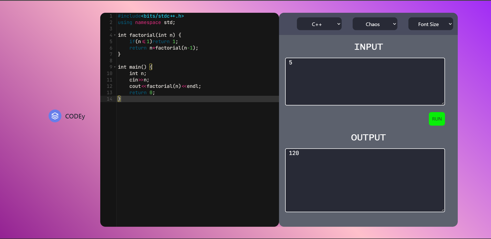

# CODEy
## It is a multilangual code editor made by me
### It supports 6 famous programming languages
1. C
2. C++
3. Java
4. Python
5. Golang
6. Javascript  

Here is some sample code execution output   
1. C program  

  
2. Cpp program   

  
3. Python program   

  
4. Javascript program   

  

``Enjoy!!!``
